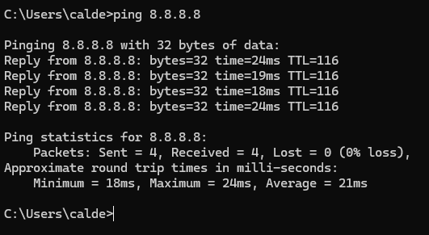
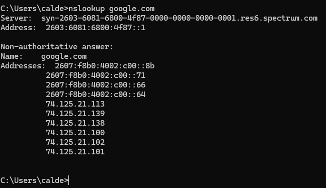

# Lab 01: Network Connectivity Troubleshooting

## Scenario
User reports they are connected to the network but cannot access the internet.

## Device
Windows 10 or Windows 11

## Objective
Identify whether the issue is related to IP addressing, gateway connectivity, or DNS resolution.

## Step 1: Check IP Configuration

Command used:
ipconfig

## Step 2: Test Gateway Connectivity

Command used:
ping 192.168.1.1

## Step 3: Test Internet Connectivity (Without DNS)

Command used:
ping 8.8.8.8

## Step 4: Test DNS Resolution

Command used:
nslookup google.com

## Findings

- The system received a valid IPv4 address from the network.
- The default gateway was reachable with no packet loss.
- The system was able to reach the internet using a public IP address.
- DNS resolution successfully translated domain names to IP addresses.

## Conclusion

No network connectivity issues were identified during troubleshooting. The device was functioning normally at the time of testing.

## Resolution

Verified network connectivity across local network, internet access, and DNS resolution. No corrective action was required.

